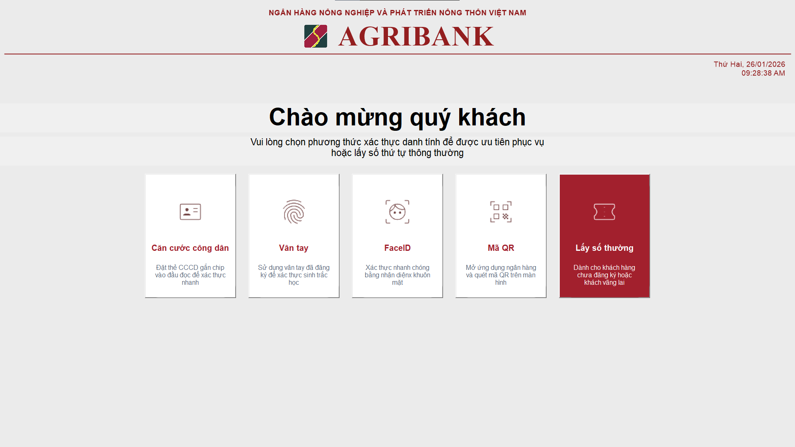
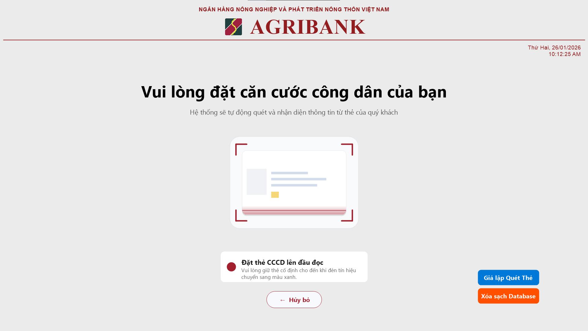
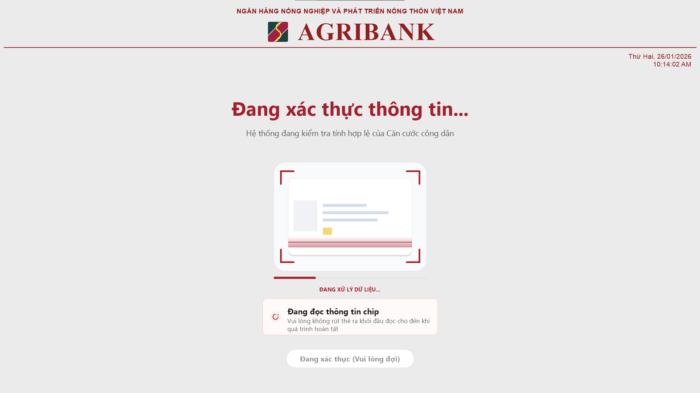
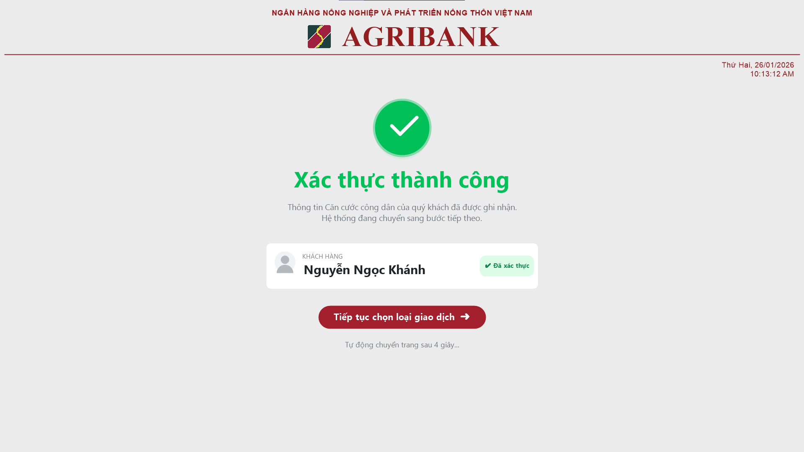
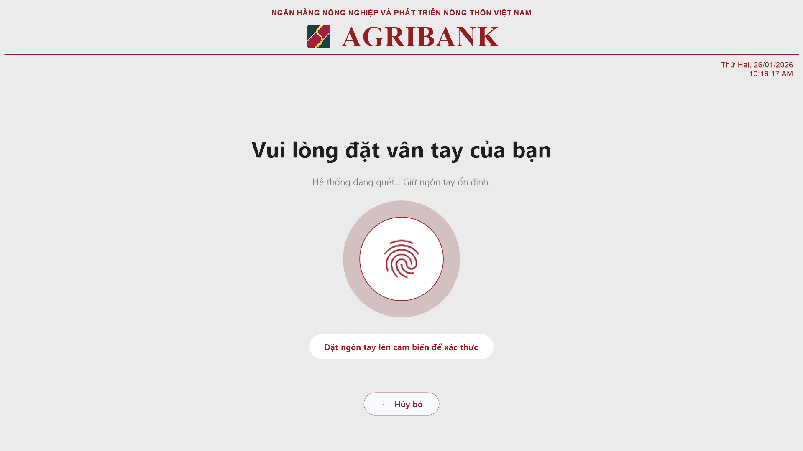
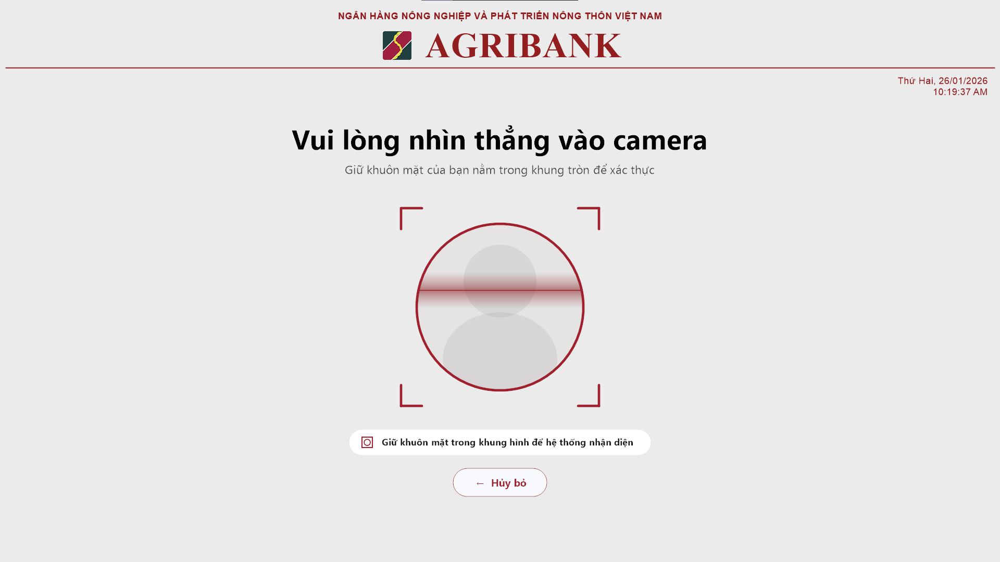
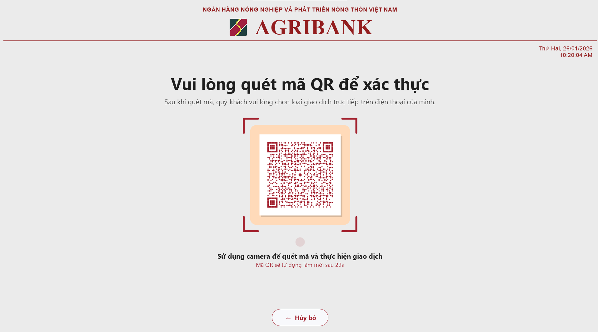
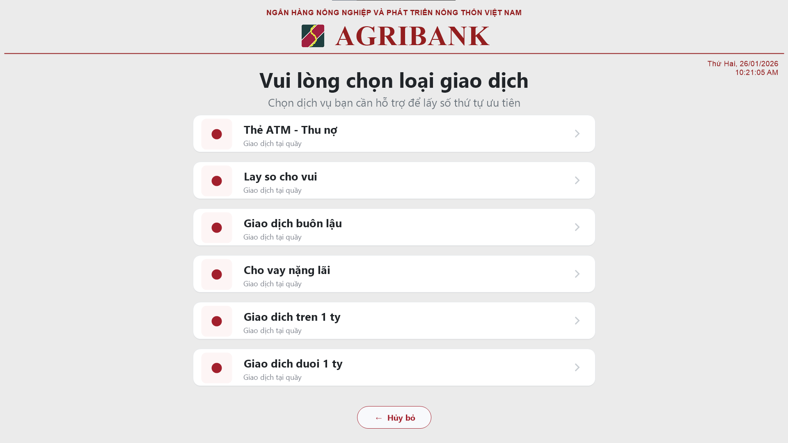
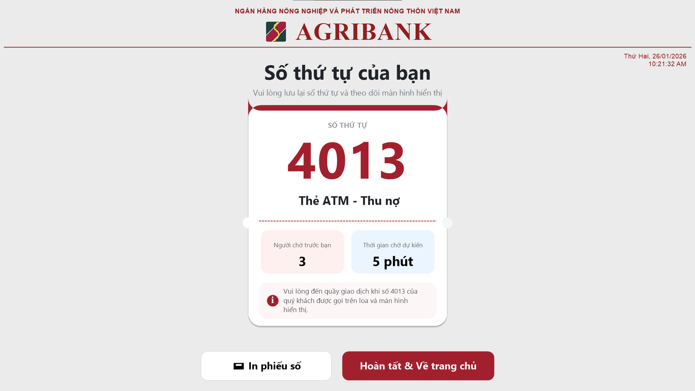

# 🏦 Bank Kiosk QMS - Automated Queue Management System

> A smart Kiosk solution for transaction queue management, featuring 5 modern authentication methods (Chip-based ID Card, FaceID, Fingerprint, QR Code, Standard Number) and a professional GDI+ interface.

## 📖 Introduction
**Agribank Kiosk QMS** is a high-performance software application built on **C++ (MFC)**. It is designed for touchscreen Kiosks to help customers proactively obtain queue numbers using various authentication methods.

---

## 🖥️ Screen 1: Welcome & Authentication Selection
This is the main home screen of the kiosk. It presents **5 distinct options** for the customer to identify themselves or get a ticket.



* **Citizen ID Card:** For customers with Chip-based ID cards.
* **Fingerprint:** Biometric login for registered customers.
* **FaceID:** Fast facial recognition (New Feature).
* **QR Code:** Scan via the Agribank E-Mobile Banking app.
* **Standard Number:** (Red Button) For walk-in guests without authentication.

---

## 🖥️ Screen 2: Citizen ID Card (CCCD) Flow
A high-security workflow that reads data from the NFC Chip on the Citizen ID Card.

### Step 2.1: Instruction
When the user selects "Citizen ID Card", the screen displays visual instructions to place the card on the reader.


### Step 2.2: Reading & Processing
Once the card is detected, the system locks the UI and shows a "Processing" state. The reading happens on a background thread to ensure stability.


### Step 2.3: Successful Identification
Upon successful reading, the customer's full name is displayed (e.g., "Nguyen Ngoc Khanh") to confirm identity before proceeding.


---

## 🖥️ Screen 3: Fingerprint Authentication
Designed for loyal or VIP customers who have registered their biometric data.

* **Interface:** The screen displays a fingerprint icon with a **"Pulse" animation** (red glowing circle) to indicate the sensor is active and waiting for input.
* **Process:** The customer places their finger on the sensor -> System matches the template -> Automatically retrieves customer profile.



---

## 🖥️ Screen 4: FaceID Authentication
Uses a camera to recognize the customer's face.

* **Interface:** A camera preview window appears with a framing guide.
* **Process:** The system captures the facial features and compares them with the database for instant verification without needing physical cards.



---

## 🖥️ Screen 5: QR Code Authentication
If the user selects "QR Code", the system generates a **Dynamic QR Code**.

* **Security:** The QR code auto-refreshes every 60 seconds (countdown timer displayed).
* **Action:** Customers scan this code using their Agribank E-Mobile Banking App to sync their profile and queue up.



---

## 🖥️ Screen 6: Service Selection
After successful authentication (or if "Standard Number" is chosen), the customer sees the list of available banking services.

* **Dynamic Content:** This list is fetched from the API Server (`/api/service/activelist`), ensuring it is always up-to-date with the branch's services.
* **UI:** Large, touch-friendly buttons with icons and descriptions.



---

## 🖥️ Screen 7: Ticket Issuance (Result)
The final screen displays the issued queue ticket details.

* **Ticket Number:** Large, clear display (e.g., 4008).
* **Queue Info:** Shows "People ahead" and "Estimated wait time".
* **Actions:** The ticket is printed automatically via the Thermal Printer, or the user can press "Finish" to return to the Welcome screen.



---

## ⚙️ System Requirements & Config

* **OS:** Windows 10 / 11 (64-bit).
* **Hardware:** Touchscreen Monitor, NFC Reader, Thermal Printer, Webcam.
* **Configuration (`config.ini`):**

```ini
[Server]
ApiBaseUrl=http://10.10.1.21:8081
ConnectionTimeout=15000

[Auth]
ApiKey=AGRIBANK_SECURE_KEY_2026

[Printer]
PrinterName=XP-80C